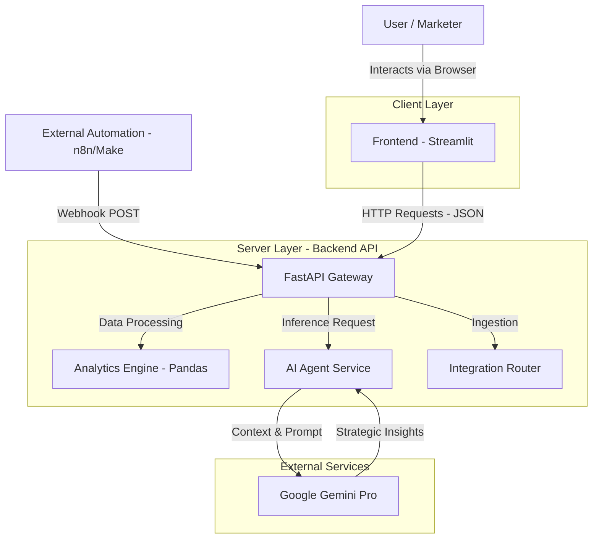

# AI Marketing Performance Optimizer - System Architecture

## High-Level Overview

The system follows a **Decoupled Architecture** pattern, separating the user interface (Frontend) from the business logic and data processing (Backend). This design ensures scalability, maintainability, and allows for independent deployment of components.

The core functionality revolves around ingesting marketing data (via CSV or Webhooks), processing it with Pandas, and using a Generative AI Agent (Google Gemini) to provide strategic insights.

---

## Technical Stack

| Component | Technology | Description |
|-----------|------------|-------------|
| **Frontend** | Streamlit | Python-based framework for rapid data dashboarding. Handles UI state and visualization. |
| **Backend** | FastAPI | High-performance, asynchronous web framework. Manages API endpoints and validation. |
| **Data Processing** | Pandas + NumPy | Vectorized data manipulation for calculating metrics like ROAS, CPA, and CR. |
| **AI Model** | Google Gemini 1.5 Flash | Generative AI model used for analyzing data patterns and generating natural language reports. |
| **Validation** | Pydantic | Data validation and settings management. Ensures data integrity for CSVs and Webhooks. |
| **Visualization** | Plotly | Interactive charting library used in the frontend. |

---

## Project Structure & Modules

The project is organized as a monorepo containing both the backend API and the frontend dashboard.

### 📂 `backend/`

The core logic of the application.

- **`main.py`**: The entry point of the API. Configures CORS and registers routers.

- **`routers/`**: Handles HTTP requests and routing.
  - `data_analytics.py`: Endpoints for file upload and metric calculation.
  - `recommendations.py`: Endpoints for AI report generation.
  - `integrations.py`: Webhook endpoints for real-time data ingestion (n8n/Make).

- **`services/`**: Business logic layer.
  - `metrics_engine.py`: Pure functions for calculating marketing KPIs using Pandas.
  - `ai_agent.py`: Manages the connection with Google Gemini and prompt engineering.

- **`models/`**: Pydantic schemas defining input/output data structures (*The Contract*).

### 📂 `frontend/`

The presentation layer.

- **`app.py`**: The main entry point for the Streamlit application.
- **`pages/`**: Modular pages for navigation (Upload Data, Dashboard, AI Insights).
- **`utils/`**: Helper functions, specifically the API Client (`api_client.py`) which handles communication with the Backend.
- **`assets/`**: Custom CSS styling.

---

## Data Flow

### Scenario A: Batch Analysis (CSV Upload)

1. User uploads a CSV file via the Streamlit interface.
2. Frontend sends the file to `POST /analytics/upload-csv`.
3. Backend validates the file structure using Pydantic models.
4. `metrics_engine` processes the data using Pandas to calculate ROAS, Total Spend, and Revenue.
5. Backend returns a JSON summary to the Frontend.
6. Frontend stores the result in `st.session_state` and renders interactive charts.

### Scenario B: AI Consultation

1. User clicks "Generate AI Report" on the frontend.
2. Frontend sends the calculated metrics summary to `POST /ai/generate-insights`.
3. `ai_agent` constructs a context-aware prompt and sends it to Google Gemini.
4. Gemini returns a markdown-formatted strategic analysis.
5. Frontend displays the report to the user.

### Scenario C: Real-Time Ingestion (Webhook)

1. An external tool (e.g., n8n) sends a JSON payload to `POST /integrations/webhook/ingest-data`.
2. Backend validates the payload (including email validation).
3. Data is processed/logged (simulated in-memory storage for MVP).
4. Dashboard updates the "Live Feed" section by polling the backend.

---

## Scalability & Future Roadmap

| Area | Current State | Future Implementation |
|------|---------------|----------------------|
| **Database** | In-memory processing for speed | PostgreSQL (via SQLAlchemy) for persistent data storage |
| **Authentication** | None | JWT Authentication to support multi-tenancy |
| **Async Processing** | Synchronous | Celery + Redis for background tasks on large datasets |
